# Echoes of the Lost World

## 🌟项目简介
基于 [Cocos2d-x 4.0](https://docs.cocos.com/cocos2d-x/manual) 并参考游戏《原神》、《塞尔达》开发的开放世界探险游戏项目。

玩家可以在广阔的虚构世界中自由探索，解锁不同区域，完成各种任务，与NPC交互，并参与战⽃。游戏包含了多样的环境、复杂的任务链和丰富的角色发展系统。

相关课程：2024同济大学程序设计范式

## 🌟玩法说明

> ### 按键功能汇总

  | 按键 | 功能 | 
  | :---: | :---: |
  | W/S/A/D | 移动 |
  | J | 攻击 |
  | C | 与NPC交互、在神像前清除迷雾 、在房屋门前进入室内 |
  | B | 打开背包及任务面板 |
  | M | 切换小地图视角 |
  | up/down/left/right | 移动小地图视角 |
  | Esc | 调节背景音乐音量 |
  | 鼠标滚轮 | 缩放大小地图 |
  
> ### 角色创建与新手教程
  
  - #### 角色创建
  
    进入游戏后，玩家可选择喜爱的角色。
    
    

    
    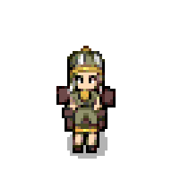
    
    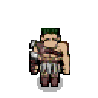
    
    

  - #### 新手教程
    
    接着进入新手教程，玩家将在此根据指引学习基础的移动、攻击、交互、解锁地图、传送等操作。

> ### 开放世界简介

  完成新手教程后，初始地图解锁，玩家进入复苏神庙。游戏进入开放世界阶段，玩家可以自由探索地图、解锁地图区域、收集武器及特殊物品，并通过击败敌人提升实力。

  开放世界共分为四个不同的种族村落，分别具有不同的地形，分别为：雪地（冰寂之原）、森林（青木迷境）、火山（炎魂裂谷）、沙漠（赤砂荒原）。玩家可以自行前往不同区域，解锁不同的剧情。

> ### 地图操作

  - #### 大地图

    玩家默认进入的地图为大地图，大地图具有放大、缩小的功能。地图会随着人物移动更新画面，保持人物在屏幕中央。

    大地图中的场景不仅有室外场景，还包括室内场景。玩家可以自由进出房屋，体验丰富。

  - #### 小地图

    小地图即整个开放世界的缩略图。在小地图中，依然保留了放大、缩小的功能。除此之外，还增加了移动视角的功能，以全面查看小地图的情况。需要特别指出的是，小地图默认有迷雾覆盖。玩家每前往一个新的区域，都需要找到神像并进行解锁锚点的操作，使得小地图的迷雾消散。该区域迷雾消散后，玩家可通过点击小地图上锚点的位置进行角色传送。

> ### 背包操作

  - #### 背包系统

    背包中展示了玩家拥有的所有武器、装备及各种特殊物品。玩家可以选择给角色配备或卸下武器、装备等物品，也可以选择特殊物品进行使用。背包右侧的角色面板中还展示出了角色的血量、攻击力、等级、防御值及速度。除此之外，背包中还显示了玩家所拥有的金币，玩家可以通过与特定的NPC进行交互以购买武器、装备及特殊物品。

    - 食物（示例）：

      

      
      
      
      

  
    - 装备（示例）：

      

      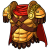
      
      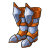
      

    - 武器（示例）：

     

     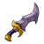
     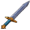
     
     

    - 特殊物品（示例）：

     

     
     
     
     

     
  - #### 任务系统

    任务系统中包含两个模块：主线任务、支线任务。玩家解锁任务后可查看任务的具体信息，任务完成后，任务状态会自动更改为已完成。在任务板块，玩家可以通过上下滑动滚动条来查看多个任务。

> ### 战斗操作

  开放世界中存在多个怪物，玩家可自行选择与怪物进行战斗。怪物具备高级AI，能根据玩家策略调整战斗行为。

> ### NPC与任务系统

  开放世界中存在多个npc，每个村落中有一个NPC负责介绍剧情并引出主线任务。玩家前往与之交流，即可了解村落的背景故事，并解锁对应的主线任务，开启打怪的旅程。主线任务完成后，会自动更改成已完成的状态。

  除此之外，游戏还设置了多个支线任务，支线任务与主线任务相互独立，具有丰富的类型。如：购买装备、获取食物、寻找人物。

  - 负责解锁剧情及各村落的主线任务的NPC：

  

  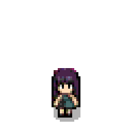
  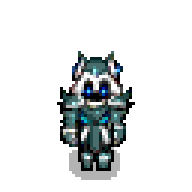
  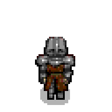
  
  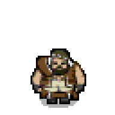
  

  - 提供装备购买功能的NPC：
  
  

  
  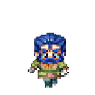
  

   - 免费提供特殊物品的NPC：
  
  

  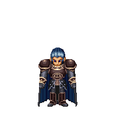
  

  - 负责钓鱼的NPC：

  

  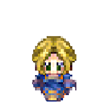
  

  - 负责聊天的NPC：

  

  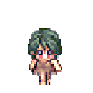
  

> ### 音乐系统

  游戏中设置了背景音乐，且支持调整音量大小的功能。除此之外，玩家打开背包、配备装备、查看任务等操作均具有不同的特殊音效。

## 🌟游戏功能

> ### 基础功能

#### 高级地图系统

- [x] 包含多种地形，每种地形具有不同的挑战

- [x] 支持大地图的探索及地图放大、缩小功能

- [x] 小地图有迷雾覆盖，玩家解锁新的区域后迷雾散去

- [x] 地图上存在锚点，玩家可在已解锁的锚点之间快速移动

- [x] 进入特定建筑时支持切换到室内地图

#### 战斗系统

- [x] 实时战斗机制，提供丰富的战斗体验

- [x] 怪物具备高级AI，能根据玩家策略调整战斗行为

#### 角色系统

- [x] 支持玩家选择角色，配置装备

- [x] 角色可以通过经验升级，提升能力

#### 任务系统

- [x] 包含多个主线任务及多个支线任务，任务类型多样，包含战斗、寻宝等

#### 背包系统

- [x] 玩家可以收集、使用、升级各种装备，包含武器、鞋子、护甲、特殊物品等

#### 交互系统

- [x] 玩家可以和环境中的多个元素进行交互，如NPC
  
> ### 附加功能

#### 音乐系统

- [x] 支持在不同场景播放不同的音乐，战斗时具有不同的音效

- [x] 支持调节声音大小

#### 地图系统

- [x] 地图种类多样且均为原创，各地图均为小组成员使用Tiled自行绘制得到

- [x] 地图完成了碰撞设置，玩家无法在障碍处行走
  
- [x] 设置了摄像机，实现摄像机跟随角色移动的功能，确保玩家处于屏幕中央

#### 碰撞系统

- [x] 完成了碰撞框的设置，使得角色与NPC不会重叠

#### 交易功能

- [x] 设置了金币，实现购买武器、装备的功能

#### UI设计

- [x] 画风统一，画面精美；按键均具有初始、按下两种不同的状态，提升了用户的体验感

- [x] 设计丰富多样，除了按键外，还存在滑动条、进度条、血条、滚动框

## 🌟代码架构

- 地图相关类

  - [MapManager](Classes/MapManager.h)
  - [MainGameScene](Classes/MainGameScene.h)
  - [CameraManager](Classes/CameraManager.h)

- 人物相关类

  - [Creature](Classes/Creature.h)
    - [NPC](Classes/NPC.h)
    - [Player](Classes/Player.h)
    - [Monster](Classes/Monster.h)

- 背包及任务相关类

  - [BagManager](Classes/BagManager.h)
  - [item](Classes/Item.h)

- 其它类

  - [music](Classes/BackgroundMusic.h)
  - [LearningScene](Classes/LearningScene.h)
  - [SetPlayerScene](Classes/SetPlayerScene.h)
  - [LoadingScene](Classes/LoadingScene.h)

## 🌟集成开发环境与编译运行环境

- Windows系统：Windows 11 x64

- Windows集成开发环境：Microsoft Visual Studio 2022

- Windows编译运行环境：本项目适用于x86架构

## 🌟成员贡献度及分工

| 姓名 | 学号 | 贡献度 | 分工 | 
| :---: | :---: | :---: | :---: |
| [王雷](https://github.com/WingWR) | 2351299 | 20％ | 高级地图系统的设计与开发 |
| [周达](https://github.com/zdlovepro) | 2354185 | 20％ | 作战系统的设计与开发 |
| [林琪](https://github.com/lq1911) | 2352609 | 20％ | 人物系统及交互系统的设计与开发 |
| [陈柏熙](https://github.com/cbx6666) | 2353120 | 20％ | 背包及装备系统、任务系统、音乐系统的设计与开发 |
| [黄景胤](https://github.com/7719Drinkin) | 2351129 | 20％ | 高级地图系统的设计与开发 |

